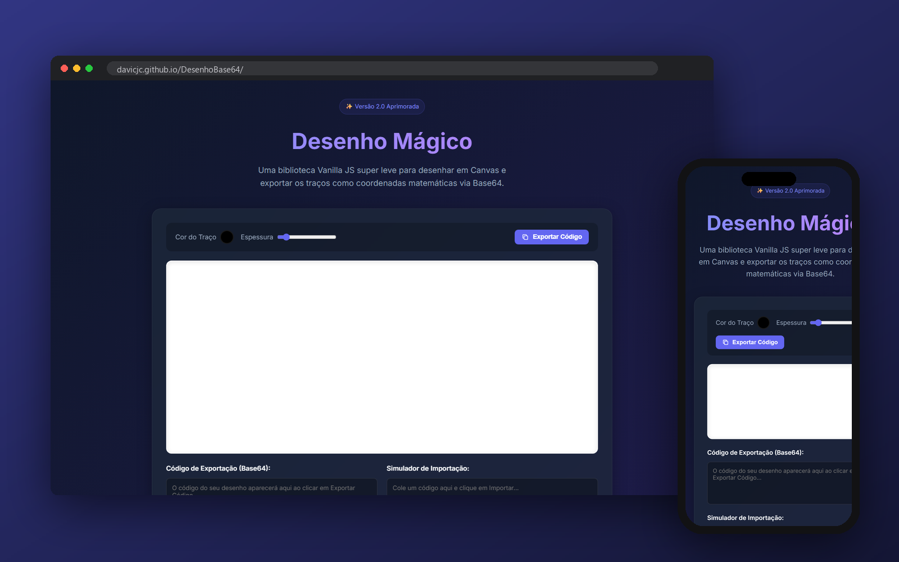

<p align="center">
  
</p>

<p align="center">
  
  <a href="https://davicjc.github.io/DesenhoBase64/"></a>
  
  
</p>

<p align="center">Desenho Mágico: biblioteca JavaScript leve, sem dependências, para desenhar no canvas e exportar em Base64 — assinaturas, lousas e rabiscos.</p>


<p align="center">
  
</p>

---

[]()
[]()
[]()

**🏷️ Palavras-chave:** `conversor de desenho para código` | `assinatura eletrônica` | `quadro branco JS` | `canvas para Base64` | `lousa virtual EAD` | `whiteboard javascript` | `desenho online`

Uma biblioteca JavaScript super leve e sem dependências para transformar a tag `<canvas>` do HTML5 em um quadro de desenho interativo ou painel de assinatura eletrônica.

Diferente de outras bibliotecas que exportam o Canvas inteiro como uma imagem pesada (`.png` ou `.jpg`), o **Desenho Mágico** salva apenas a matemática (coordenadas `[x, y]`, espessura e cor de cada traço), gerando um código em Base64 extremamente leve e fácil de ser armazenado em qualquer banco de dados relacional ou NoSQL.

## 💡 Para que serve e Onde usar?

O Desenho Mágico foi pensado para resolver os seguintes problemas e casos de uso:
- **Assinaturas Eletrônicas:** Capturar a assinatura manuscrita de um cliente em contratos web ou sistemas de ERP.
- **Jogos em Tempo Real:** Transferir os traços desenhados de um jogador para outro via WebSocket (estilo *Gartic* ou *Draw Something*), já que o formato de exportação é minúsculo.
- **Anotações Livres e EAD:** Incorporar um quadro branco simples para anotações rápidas em painéis de ensino à distância.

## 🚀 Como instalar e usar

Como a biblioteca é Vanilla JS puro, você **não precisa de npm** ou empacotadores (embora funcione perfeitamente com eles).

### 1. Baixe o arquivo
Copie o arquivo `desenho-magico.js` para dentro da pasta do seu projeto.

### 2. Adicione o Canvas no seu HTML
Crie a tag onde o quadro branco deverá aparecer:
```html
<canvas id="meuQuadro" width="600" height="400" style="border: 2px solid #ccc;"></canvas>
```

### 3. Importe o script e inicie a classe
No final da tag `<body>`, inclua a biblioteca e instancie-a apontando para o ID do canvas que você criou:

```html
<script src="./desenho-magico.js"></script>
<script>
  // 1. Inicializa o quadro branco
  const meuDesenho = new DesenhoMagico('meuQuadro', {
      lineWidth: 3,           // Espessura padrão do pincel
      lineColor: '#000000',   // Cor inicial do traço (Preto)
      sensibilidade: 3        // Otimização: ignora micro-movimentos do mouse
  });

  // 2. EXPORTAR: Salva o desenho feito e converte para Base64
  function salvar() {
      const codigo = meuDesenho.gerarCodigo();
      console.log("Guarde este código no seu Banco de Dados:", codigo);
  }

  // 3. IMPORTAR: Restaura um desenho salvo na tela
  function carregar(codigoAntigo) {
      const sucesso = meuDesenho.carregarCodigo(codigoAntigo);
      if(sucesso) {
          alert("Desenho restaurado com sucesso!");
      } else {
          alert("Código inválido!");
      }
  }

  // 4. LIMPAR: Apaga tudo do quadro
  function limpar() {
      meuDesenho.limparTela();
  }
</script>
```

## 🛠️ Modificando o Pincel Dinamicamente

Você pode trocar a cor e a espessura do pincel a qualquer momento. A biblioteca registrará automaticamente essas propriedades em cada traço, e quando o código for exportado/importado, o desenho manterá exatamente a espessura e cor originais de cada parte.

```javascript
// Alterando o pincel para um traço vermelho mais grosso
meuDesenho.lineColor = '#ff0000';
meuDesenho.ctx.strokeStyle = '#ff0000'; // Aplica ao Canvas

meuDesenho.lineWidth = 10;
meuDesenho.ctx.lineWidth = 10; // Aplica ao Canvas
```

## 📜 Licença

Totalmente Open Source. Sinta-se livre para usar, modificar e incorporar em projetos comerciais, pessoais ou de estudos!

---

<p align="center">Feito por <a href="https://github.com/Davicjc">Davi Castro</a> · <a href="https://davicjc.com">davicjc.com</a></p>
